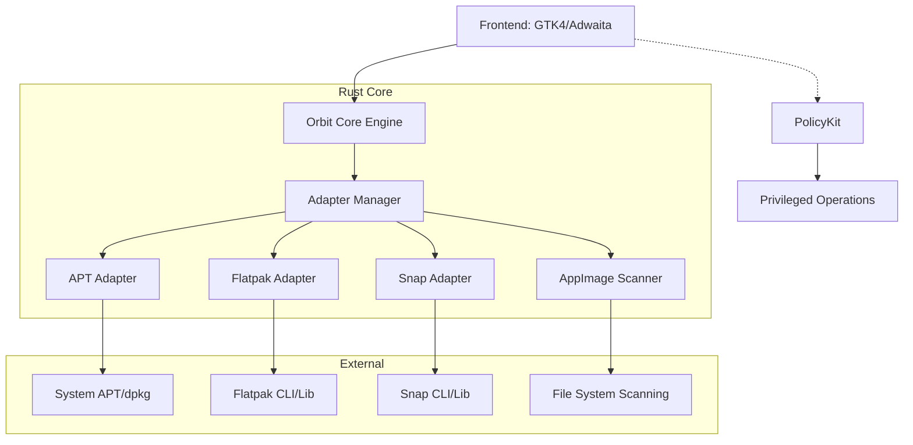

# Orbit Architecture Diagram

## Module Interactions

1. **Adapters**: Each adapter implements a common `PackageAdapter` trait.
2. **Adapter Manager**: Polls all adapters to build a unified cache of installed applications.
3. **App Cache**: Stores application metadata to prevent redundant system calls.
4. **UI Thread**: Communicates with the Core via async channels to keep the interface responsive during long-running operations (like updates).
